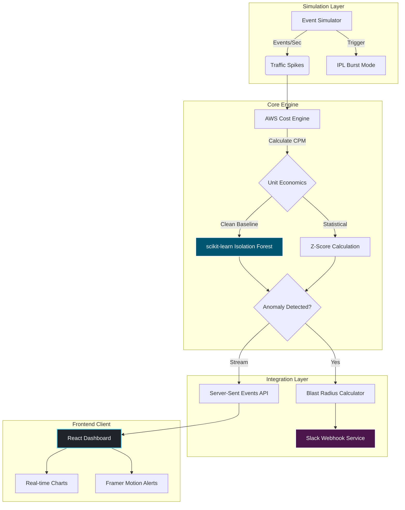

<div align="center">
  <h1>⚡ EventCostRadar</h1>
  <p><strong>A Real-Time Cost-Per-Event Anomaly Dashboard for High-Throughput MarTech Infrastructure</strong></p>
  
  [](https://fastapi.tiangolo.com/)
  [](https://reactjs.org/)
  [](https://tailwindcss.com/)
  [](https://www.docker.com/)
  [](https://scikit-learn.org/)
</div>

<br />

> "To deliver messaging at CleverTap's scale, we don’t just optimize for performance; we have to optimize for unit economics. When you're pushing 289 million events per second during an IPL match, an architectural inefficiency doesn't just slow things down—it destroys margins."
> 
> — *Inspired by CleverTap's Engineering Culture & CloudZero approach*

## 📖 The Problem

Existing cloud FinOps tools (AWS Cost Explorer, Kubecost, Datadog) are designed for daily or weekly aggregations. They **do not correlate cloud cost spikes with application-level traffic burst events in real-time**.

When a massive traffic burst occurs (e.g., an IPL match start or a flash sale), auto-scaling groups scale out. If an inefficiency exists—like excessive cross-AZ NAT gateway fees or an unoptimized query—the overall volume masks the problem, but the **Cost-per-Million-Events** quietly skyrockets. By the time a billing alarm fires 12 hours later, thousands of dollars are lost.

## 💡 The Solution

**EventCostRadar** bridges event-stream observability with cloud cost intelligence. Built specifically for MarTech-scale infrastructure, it mathematically proves when the cost efficiency of a specific microservice has degraded, regardless of the overall traffic volume.

### ✨ Key Features

- **Real-Time Unit Economics:** Calculates the blended and per-service Cost-per-1M-Events dynamically using Server-Sent Events (SSE).
- **Machine Learning Anomaly Detection:** Utilizes `scikit-learn` Isolation Forests paired with Z-Score rolling baselines to detect non-linear anomalies in microseconds.
- **Blast Radius Projection:** Instantly calculates the projected monthly $$ overrun if the anomaly isn't fixed, prioritizing engineering response.
- **Actionable ChatOps:** Fires immediate Slack webhooks with context-aware remediation suggestions for the on-call engineer.
- **High-Performance Dashboard:** A bespoke "Cyberpunk Data Center" UI utilizing Framer Motion, glassmorphism, and Recharts.

---

## 🏗️ System Architecture

EventCostRadar simulates a highly distributed backend logging architecture.



---

## 🛠️ Technology Stack

| Layer | Technology | Purpose |
| :--- | :--- | :--- |
| **Backend API** | Python 3.11 + FastAPI | Async architecture, SSE streaming, high-throughput REST endpoints. |
| **ML Engine** | Scikit-Learn + NumPy | Isolation Forest algorithm for multi-dimensional anomaly detection. |
| **Frontend** | React (Vite) | Lightning-fast HMR and optimized production builds. |
| **UI / UX** | Tailwind CSS v4 + Framer Motion | Custom neon-glassmorphic styling with micro-interactions. |
| **Data Viz** | Recharts | Canvas-based rendering for high-frequency live data charting. |
| **Deployment** | Docker & Docker Compose | Containerized for "one-click" deterministic local environments. |

---

## 🚀 Getting Started

### Prerequisites
* Docker & Docker Desktop installed.
* (Optional) A free Slack Incoming Webhook URL.

### 1. Local Deployment (Docker Compose)

```bash
# Clone the repository
git clone https://github.com/Neerav02/EventCostRadar.git
cd EventCostRadar

# Set up environment variables
cp .env.example .env

# Spin up the infrastructure
docker-compose up --build -d
```
* **Frontend Dashboard:** `http://localhost:5173`
* **Backend API Docs:** `http://localhost:8000/docs`

---

## 🎯 Demo Scenario

1. Open the dashboard. You will see normal background traffic (`~5k-8k events/sec`) flowing. Unit economics will remain flat and stable.
2. Click the **SIMULATE IPL BURST** button in the top right.
3. Observe the `push-delivery` event throughput spike to over `300k events/sec`.
4. Due to simulated network degradation (e.g., cross-AZ limits), the Cost-per-1M-Events for `push-delivery` will begin to artificially climb.
5. Within 10-15 seconds, the ML engine will detect the baseline deviation, fire a **Slack Alert**, calculate the financial blast radius, and highlight the anomaly visually on the frontend.

---

> [!NOTE]
> **Why Isolation Forest?**
> Standard threshold alerts fail during auto-scaling because absolute cost *always* goes up. Z-scores fail because massive traffic spikes pollute the rolling average. By combining a clean historical baseline with an Isolation Forest, the system isolates true algorithmic inefficiency from expected infrastructure scaling.

<div align="center">
  <p>Built as an Engineering Prototype by Neerav</p>
</div>
